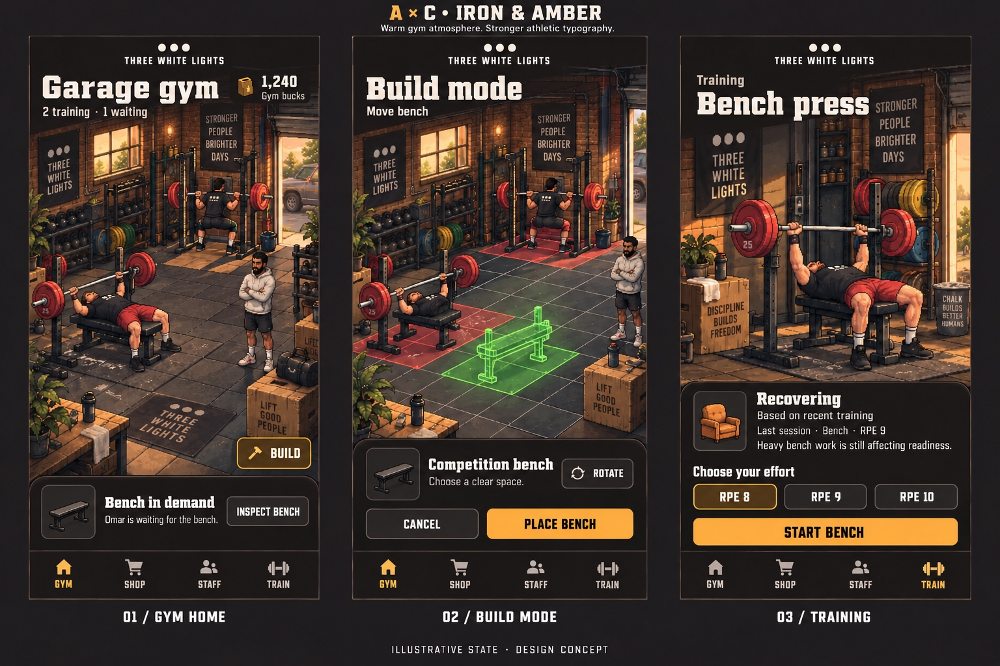

# Iron & Amber Visual Reference

**Status:** Binding design-direction reference  
**Project:** Three White Lights  
**Reference:** A × C — Iron & Amber mockup  
**Added:** 2026-09-06

## Purpose

This image is the current visual source of truth for the Three White Lights product surface. It replaces the legacy pixel-sprite presentation as the primary art direction.

This is a product-direction reference, not a claim that the mockup is final production artwork. Production assets must be owned, generated with appropriate rights, or properly licensed.

## Direction

- Warm, atmospheric gym environment
- Dark espresso, charcoal, and amber foundation
- Strong athletic typography with clear hierarchy
- Facility-first composition
- Premium illustrated presentation
- Clear gym, build, shop, staff, and train navigation
- Readable status cards and contextual drawers
- Mobile-first layouts with no clipping or horizontal overflow
- Nostalgia retained through restrained texture, expressive character moments, and polished retro accents

Nostalgia is an accent, not a requirement to preserve the existing low-resolution sprite system. Do not blanket the interface in legacy sprites or make the product look like a debug screen.

## Legacy boundary

The current sprite graphics are legacy implementation debt. They must not be treated as the target visual language or accepted as a temporary substitute once a surface is being migrated.

A visual implementation is not complete when only colors, labels, or buttons change while the old sprite composition remains the primary experience.

## Scope boundaries

Keep the two product sessions separate:

- **Session A:** training, readiness, RPE, fatigue, and Meet Day behavior.
- **Session B:** Gym Empire facility, build, shop, staff, and throughput behavior.

The shared presentation layer may use this direction across both sessions, but mechanics, worktrees, leases, PRs, and protected files remain separate.

Preserve existing logic, safety boundaries, reducer ownership, and product rules unless a separate task packet authorizes a gameplay change.

## Agent instructions

Before changing UI or UX:

1. Read this document and inspect the reference image.
2. Identify the exact screen state being changed.
3. Compare the rendered implementation against this reference, not against the legacy sprite build.
4. Verify the result at the required mobile viewport.
5. Attach before/after screenshots and the exact deployed SHA to verification evidence.

Do not report VISUAL_IMPLEMENTATION_PASS while the legacy sprite experience remains the primary surface. Automated tests and policy checks can establish technical evidence, but they cannot establish visual-direction acceptance.
